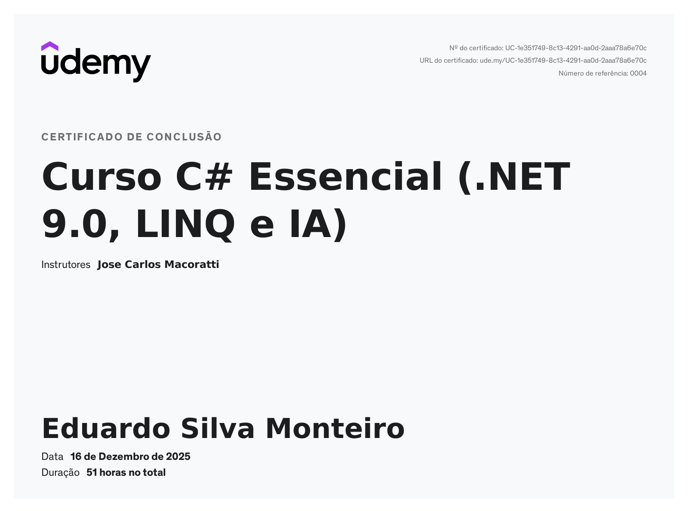

# Curso-C-Essencial-Com-LINQ-Net-7.0-.NET-8.0-e-.NET-9.0-
Códigos utilizados dentro do **Curso C# Essencial (Com LINQ, Net 7.0 .NET 8.0 e .NET 9.0)** do [Professor Jose Carlos Macoratti.](https://www.udemy.com/user/29c064ba-42de-4d29-9aec-1e1734686224/)

**Conclusão do Curso:** 16/12/2025

